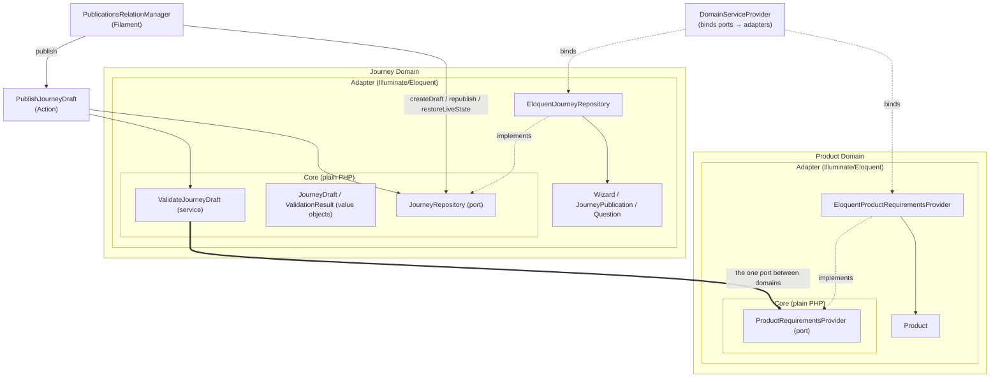

## Assumptions
 - Certain products may have certain questions that are required (domain knowledge), ensure these are still in the 
   journey.
 - Journeys map to product lines.

## Solution

- Create a product that can have required questions by a unique key
- Wizards can save and create a draft of a journey, and later publish it
- Used a journey_publications table to store the version, snapshot of the journey questions, status
- Storing current_published_version_id number on the wizard itself
- Submissions are pinned to the journey_publication_id live when the customer started, so historical answers always 
  resolve to the exact question set that produced them, regardless of later publishes
- Rolling back, using a Forward-only version number approach, rollback just gets the selected version and recreates
  that journey.
- DDD Product - Journey using hexagonal ports and adapters based design to separate the journey from the product, and
  the the provider implementation of eloquent from the business logic.

### Diagram



Solid arrows = calls/depends on. Dotted `implements` = the Eloquent adapter satisfies the domain's port. Dotted `binds` = DI wiring registered in `DomainServiceProvider`. Each domain is drawn as a **core wrapped by its adapter** — the plain-PHP `Core` (service, value objects, port) sits inside the `Adapter` ring, and only the adapter is allowed to reach outward to the Eloquent models. The bold arrow is the one edge crossing the domain boundary: `ValidateJourneyDraft` (Journey core) depends solely on the `ProductRequirementsProvider` interface — it never knows `Product` (the Eloquent model) exists, only `EloquentProductRequirementsProvider` does.

## Trade off's

### Questions
- Questions are shared, traded off between being a domain knowledge only of a wizard.
- Both Product and Questions need to be able to have knoweldge of the questions.
- Could potentially be bounded context within jounry/wizzard - and a port to access the questions.

### Validation
- Slows the process down as cross-team (product/journey)
- However, is vital in preventing errors being introduced into the journey.

### Versioning rollback
- Rollback always increasing the versioning creates a new row all the time, this makes at a code level easier to just
  'Always move forward'. We are creating more spaces in the database when we may not need to. Also reporting suffers a
   bit here potentially as if we 'rollback' we then have 2 versions that are the same.
- Tradeoff is that no 'audit log' would be required to keep track of the change and who by. Handled automatically
  with a new record. Table bloat?

### Product
- Very specific bound entry port for ProductRequirementsProvider, means we can't have a generic Product provider
  that we can use for other purposes. - however I prefer where possible having small purposeful classes like this
  that are obvious in what they do - particularly for a port being used by another domain.

## Evolving
- Multi validation of published draft before being able to publish.
- Questions available to multiple journeys - a 'bank' of questions that may be used across multiple journeys.
- Display the list of differences in the journeys before publishing.
- Ability to 'view' the old versions of a journey.

## Current pitfalls
- Rolling back currently needs thinking with the validation - we can rollback to a version that has a validation error.
- Although we have some 'validation' on the question keys, when we delete and hit save then draft + publish, the question
  has already been deleted, so we need to readd that question key - the key alone doesn't define what the question is.
  meaning yes we won't put a wizard live wihout that key, but it COULD be different. 

## Prompt Log
```
We need admins to be able to create draft versions of the wizards. Add a JourneyPublication table containing at publish time,     
serialize the current questions/copy into one JSON field, version number, published_at, published_by, and a status (enum either   
draft or publish). In the UI, we then need the ability to cerate a draft from a current journey, amend it, and publish it when
```

```
 Next we need to add a rollback feature. This will work by duplicating the previous version into a new Republish-as-new-version,   
 so snapshotting the previous version, add a field called rollback default to false, set to true on rollback, and display in the   
 versions manager - ensure we reuse code where possible.
```

```
Next we need a table and filament resource to create 'products' (id, name). Adding a key onto the questions table to uniqeluey    
identify a question, we need the ability to set a list of (array on the products) required questions.
When editing a product / creating - please select a wizzard first and populate the questions based on that, we CANT have          
questions cross wizzard 
```

Tying it together (context generated prompt with specific requirements)
```
Context

This is a Laravel 13 + Filament 5 app. A Wizard is a customer journey made of Question rows. Publishing snapshots the wizard's current questions/copy into a JourneyPublication row (version, content, status, rollback) and flips Wizard.current_published_version_id to point at it. A Product belongs to a Wizard and has a required_questions array of Question.key values — the data points that product needs answered.

Right now:

Wizard::snapshotContent(), Wizard::createDraft(), Wizard::restoreLiveStateFrom(), and Wizard::rollbackTo() live directly on the Wizard model.
JourneyPublication::publish() lives directly on that model, and reaches back into $this->wizard to snapshot content and flip the pointer.
There is no validation at all connecting Product.required_questions to what actually gets published. A PM can delete a question a product depends on and publish anyway — this is the exact risk the draft/publish workflow is meant to prevent.
app/Filament/Resources/Wizards/RelationManagers/PublicationsRelationManager.php calls $record->publish(auth()->user()) and $wizard->rollbackTo($record, auth()->user()) directly from Filament actions.
Goal

Introduce a small hexagonal boundary between two domains — Product (owns what data a product requires) and Journey (owns questions, drafts, publishing) — connected by one port, and extract the publish/rollback orchestration currently smeared across the Wizard and JourneyPublication models into a repository, since that logic already reaches across two models and belongs in one place instead.

Do not introduce ports/repositories anywhere else in the app unless you find a second concrete call site that would otherwise duplicate the same logic. Question, Submission, and Product CRUD should stay plain Eloquent, used directly from Filament, exactly as they are now — this app is Eloquent-idiomatic (see the existing app/Actions/Fortify/* convention) and most of it should stay that way. The only things earning extraction here are: (a) a genuine cross-context boundary (Product → Journey validation) and (b) persistence logic that's currently duplicated/tangled across two models.

1. app/Domains/Product — the Product Catalog boundary

Plain PHP only in this namespace — no Illuminate\* imports except in the Adapters/ subfolder.

Ports/ProductRequirementsProvider.php — interface:
php
  interface ProductRequirementsProvider
  {
      /** @return string[] the Question keys required across all products attached to this wizard */
      public function requiredQuestionKeysFor(int $wizardId): array;
  }
Adapters/EloquentProductRequirementsProvider.php — implements it by querying Product::where('wizard_id', $wizardId)->pluck('required_questions'), flattening/deduping into a single string array. This is the only class in the whole feature allowed to reference the Product Eloquent model.
2. app/Domains/Journey — the Journey Authoring boundary

Also plain PHP except Adapters/.

JourneyDraft.php — a plain value object: wizardId, name, description, and questions (array of plain arrays/objects with key, label, type, options, is_required, sort). Add questionKeys(): array and toSnapshotArray(): array (equivalent to what Wizard::snapshotContent() currently returns).
ValidationResult.php — plain value object: passed: bool, errors: string[]. Static constructors passed() / failed(array $errors).
Services/ValidateJourneyDraft.php — takes ProductRequirementsProvider in its constructor. __invoke(JourneyDraft $draft): ValidationResult diffs requiredQuestionKeysFor($draft->wizardId) against $draft->questionKeys(); any missing key becomes an error message identifying the missing key (and, if it's still findable by another live question or was one before, its last-known label — otherwise just the key). This must be unit-testable with a fake ProductRequirementsProvider, no database.
Ports/JourneyRepository.php — interface covering everything currently on Wizard/JourneyPublication for draft/publish/rollback:
php
  interface JourneyRepository
  {
      public function loadDraft(Wizard $wizard): JourneyDraft;
      public function createDraft(Wizard $wizard, bool $rollback = false): JourneyPublication;
      public function publish(JourneyPublication $publication, JourneyDraft $draft, User $publisher): void;
      public function republish(JourneyPublication $publication, JourneyPublication $source, User $publisher): void;
      public function restoreLiveState(Wizard $wizard, array $content): void;
  }

(Wizard/JourneyPublication/User types are fine to reference here since this is the port's own contract, not the domain logic itself — keep the actual bodies out of this file.)

Adapters/EloquentJourneyRepository.php — implements the above. Move the bodies of Wizard::snapshotContent(), Wizard::createDraft(), Wizard::restoreLiveStateFrom(), and JourneyPublication::publish() here almost verbatim, adapted to the interface signatures. publish() sets content/status/published_at/published_by on the publication and flips Wizard.current_published_version_id, wrapped in a DB transaction. republish() does the same but reuses $source->content verbatim instead of building a new snapshot — this is the rollback path, and it must not re-run ValidateJourneyDraft (content already passed validation once when first published; re-validating on rollback is a separate, debatable design decision — leave a short comment noting this assumption rather than silently deciding it).

After this, Wizard and JourneyPublication should lose those methods entirely and go back to being relationships + casts only (Wizard keeps questions(), submissions(), publications(), currentPublishedVersion(), scopeActive(), scopePublished(); JourneyPublication keeps wizard(), publisher()).

3. Wiring

Create app/Providers/DomainServiceProvider.php, register in bootstrap/providers.php, binding:

php
$this->app->bind(ProductRequirementsProvider::class, EloquentProductRequirementsProvider::class);
$this->app->bind(JourneyRepository::class, EloquentJourneyRepository::class);
4. app/Actions/Journey/PublishJourneyDraft.php

Follow the existing single-purpose invokable Action convention already used at app/Actions/Fortify/ResetUserPassword.php. Constructor-inject ValidateJourneyDraft and JourneyRepository.

php
public function __invoke(JourneyPublication $draftPublication, User $publisher): ValidationResult

Loads the draft via JourneyRepository::loadDraft(), validates it, and only calls JourneyRepository::publish() if ValidationResult::passed. Return the ValidationResult either way so the caller can show errors.

5. Update the Filament relation manager

In app/Filament/Resources/Wizards/RelationManagers/PublicationsRelationManager.php:

The publish action should call app(PublishJourneyDraft::class)($record, auth()->user()) instead of $record->publish(auth()->user()). If the result failed, show a Notification::make()->danger() listing the missing required questions instead of publishing. If it passed, keep the existing success notification.
The rollback action should go through app(JourneyRepository::class) (createDraft(rollback: true) + republish() + restoreLiveState()) instead of calling $wizard->rollbackTo(...) directly, since that method no longer exists on the model.
6. Tests (Pest, matching existing test conventions in tests/)
Unit test for ValidateJourneyDraft using a fake/in-memory ProductRequirementsProvider — no database — covering: passes when all required keys present; fails listing the correct missing keys when one is absent.
Feature test: publishing a draft on a wizard whose linked product requires a question key that's been deleted is rejected, the publication stays in Draft status, and Wizard.current_published_version_id is unchanged.
Feature test: publishing a compatible draft succeeds, creates a Publish-status JourneyPublication, and flips the wizard's current_published_version_id.
Feature test: rollback republishes prior content without invoking product validation (e.g. assert it succeeds even if you delete the underlying Product afterward).
Non-goals — do not do these
Do not touch the products, questions, or journey_publications migrations/schema.
Do not add a shared "data points" registry table — required-question matching stays as raw Question.key strings via Product.required_questions, as it is today.
Do not add scheduling, multi-version A/B, or any UI beyond the existing relation manager notifications.
Do not wrap Question or Submission persistence in repositories — leave them as plain Eloquent.
Before finishing

Run vendor/bin/pint and the relevant Pest test file(s); make sure phpstan/Larastan (phpstan.neon is in the repo) passes on the new app/Domains code, since it's meant to be strictly typed, framework-agnostic PHP.
```
